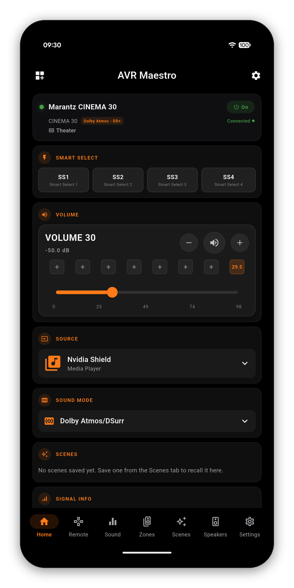
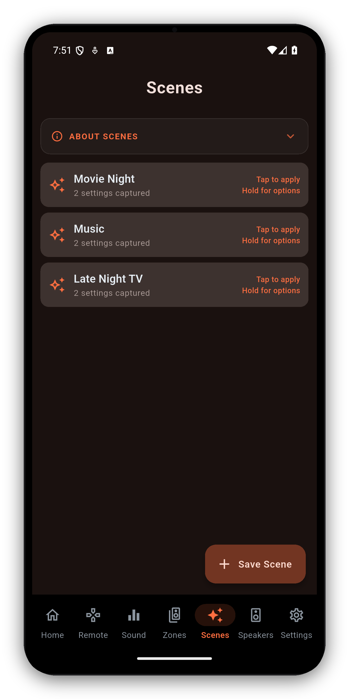
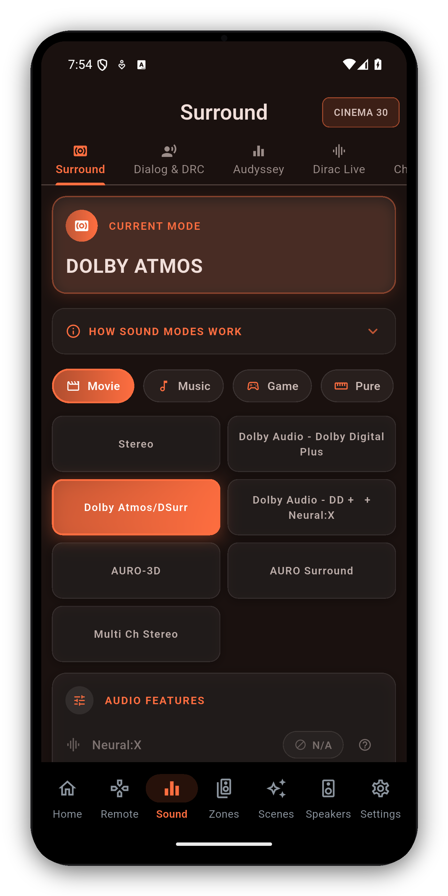
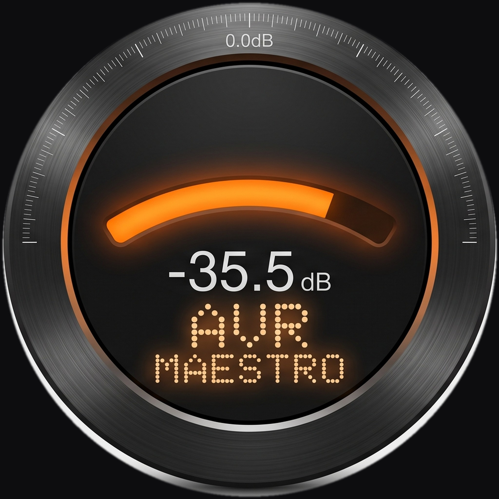

# AVR Maestro

### The premium controller for Denon &amp; Marantz AV receivers

 

## &#128214; [**Read the full visual manual &rarr;**](https://www.avrmaestro.com)

 

&nbsp;&nbsp;&nbsp;&nbsp;

---

AVR Maestro is a network controller for Denon and Marantz home-theater receivers. It speaks the receivers' native control protocols, exposes features the official apps either bury or skip, and runs without ads, without subscriptions, and without sending your data anywhere.

Connect to a receiver on your local network and the app becomes your remote: power, volume, inputs, surround modes, room correction, speaker calibration, multi-zone control, an FM/AM tuner, and a live now-playing display.

### What's inside

- **Scenes** - capture your whole setup (input, volume, sound mode, Audyssey/Dirac, speaker preset, levels, zones, tuner and more) and recall it in one tap.
- **Sound &amp; surround** - every mode, Audyssey MultEQ/DynEQ/DynVol/LFC, Dirac Live slot selection, dialog, tone, Cinema EQ and the upmixer parameters.
- **Speaker calibration** - a dedicated Speakers tab: Layout, Distances, Levels, Crossovers, Subwoofer and Speaker Presets.
- **Multi-zone** - independent Zone 2 / Zone 3 power, input and volume.
- **A real remote** - full D-pad, transport, a live IN/OUT channel map, plus rename/reorder of your inputs.
- **Power features** - TJ Mode accent colors, a customizable dashboard, hide/reorder tabs, FM/AM tuner presets, HEOS now-playing, backup &amp; restore, home-screen widgets and hardware volume keys.

&#128073; **The full, illustrated manual lives here:** **https://www.avrmaestro.com**

---

## Report a bug or request a feature

This is the **public bug + feature request repo** for AVR Maestro. (The app source code lives in a separate, private repository.)

- **[Report a bug](https://github.com/MiyaraHub/avrmaestro/issues/new?template=bug_report.yml)** - the app crashed, a button doesn't work, something looks wrong.
- **[Request a feature](https://github.com/MiyaraHub/avrmaestro/issues/new?template=feature_request.yml)** - something the app should do but doesn't.

For general questions, drop into [Discord](https://discord.gg/UmVtxE5fXN), the [Facebook community](https://www.facebook.com/groups/avrmaestro), or email [admin@miyarahub.com](mailto:admin@miyarahub.com).

## Supported receivers

Networked Denon and Marantz receivers from 2014 onward - Denon AVR (X-series), Denon AVC (A1H, X8500H+), Marantz Cinema (30/40/50+), Marantz SR (5015/6015/7015+) and Marantz AV (AV7706/AV8805/AV10+).

Reachability comes down to your network, not just the model. If the receiver's own web portal, the HEOS app and the official Denon or Marantz app can all reach it on the same network - and its network ports aren't blocked - AVR Maestro should see it too.

## Support

- **Bugs / features:** [open an issue](https://github.com/MiyaraHub/avrmaestro/issues/new/choose)
- **Discord:** [discord.gg/UmVtxE5fXN](https://discord.gg/UmVtxE5fXN)
- **Facebook:** [facebook.com/groups/avrmaestro](https://www.facebook.com/groups/avrmaestro)
- **Email:** [admin@miyarahub.com](mailto:admin@miyarahub.com)

If the app made your home theatre easier to live with, leave a review on the Play Store or App Store - it genuinely helps the project keep shipping updates.

---

**A MiyaraHub Technologies app**

&copy; MiyaraHub Technologies LLC. All rights reserved. AVR Maestro is not affiliated with, endorsed by, or sponsored by Denon, Marantz, Sound United, or Masimo Consumer.

